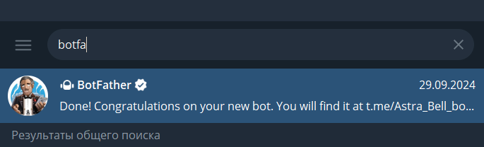
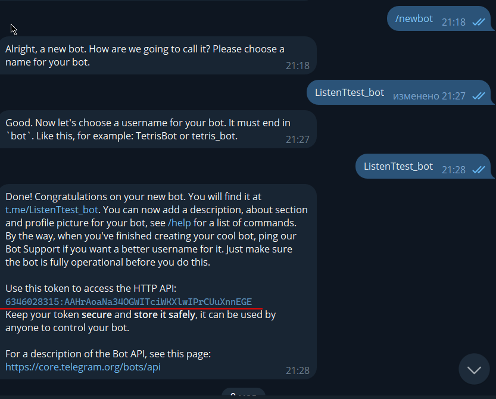
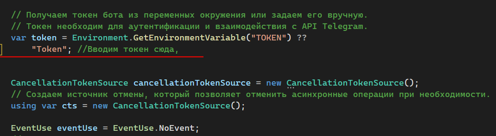
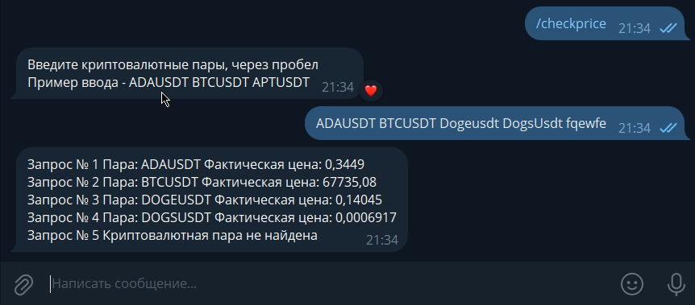
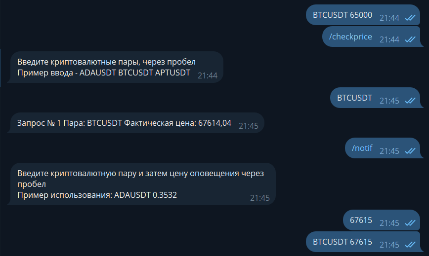
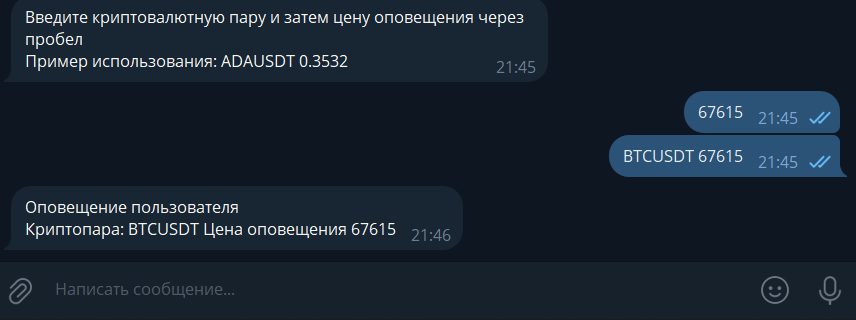

# Привет, мир!

Я решил создать небольшого телеграм-бота, который извлекает цены с биржи Bybit и выполняет с ними различные операции. Этот проект еще находится в разработке и будет продолжать дополняться.

## 🚀 Основной функционал

1. **Получение цены криптоактива** (✅ Реализовано)
2. **Постановка оповещения о цене для определенного криптоактива** (⚠️ Реализовано, но требует доработки)
3. **Генерация рыночных оповещений**, сигнализирующих о том, что актив (какой-либо) сейчас активен (❌ Нереализовано)

---

## 📦 Инструкция по установке и запуску

### 1. Генерация токена

1. Перейдите в Telegram и найдите пользователя [BotFather](https://t.me/botfather).
2. Создайте нового бота, используя команду `/newbot`.
3. Задайте имя бота и его ссылку. После завершения всех проверок вы получите токен бота.

   
   

### 2. Настройка токена в программе

1. Откройте файл `Program.cs` и впишите токен во второй фрагмент (первый фрагмент берет переменную из окружения).

   

### 3. Запуск бота

Теперь всё готово! Запустите бота и используйте команду `/start` для получения справки по доступным командам.

---

## 📊 Примеры использования

1. **Получение цены**

   

2. **Использование оповещений**

   
   

3. **Генерация рыночных оповещений активности рынка**
Вводите запрос на определённую криптопару и "Силу рынка" иначе говоря показатель активности рынка.
Данная активность находится путем рисования простой скользящей средней (15свечей) и при пересечениии свечи объема на опделенный коэфицент (этот коэф. -как раз таки активность рынка что писалась выше)
То приходит рыночное оповещение об активности рынка.
---

Если у вас есть идеи или исправления, создайте, пожалуйста, ветку **pull request** или **Issues**.
